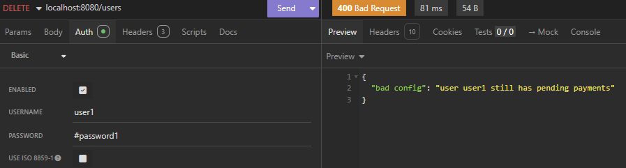
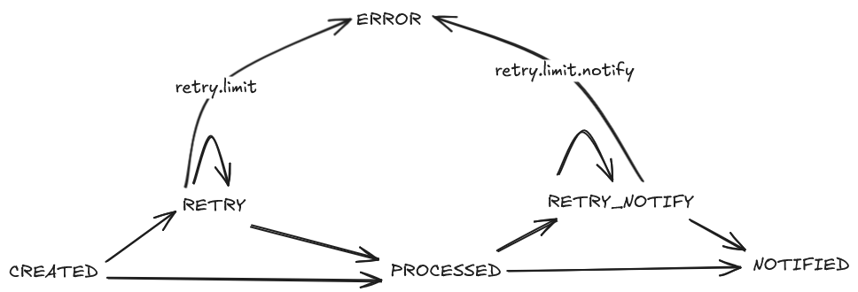

## payment processor app

### how it works

the idea is to process payments that will trigger a webhook call with custom payload.

### tech stack

- java 17
- spring 3.5.6
- mysql 9
- docker compose

### how to run

`docker compose up`

### ddl diagram


### apis

- `POST /users` to create a user
- `DELETE /users` to delete a user and all associated information
- `PUT /banking-details` to save banking details
- `POST /payments` to create payments
- there's an `openapi.yaml` file at root if needed

in short, payments can only be created for users with saved banking details

### usage examples

#### creating user

```
curl --request POST \
  --url http://localhost:8080/users \
  --header 'Content-Type: application/json' \
  --data '{
	"username": "user2",
	"password": "pass2"
}'
```


#### deleting user

```
curl --request DELETE \
  --url http://localhost:8080/users \
  --header 'Authorization: Basic dXNlcjI6cGFzczI=' \
```



#### saving banking details

```
curl --request PUT \
  --url http://localhost:8080/banking-details \
  --header 'Authorization: Basic dXNlcjI6cGFzczI=' \
  --header 'Content-Type: application/json' \
  --data '{
	"accountNumber": "acc1",
	"routingNumber": "rou2",
	"bankName": "bank3",
	"webhookUrl":"https://webhook.site/0d8a8758-72f3-4d31-9069-c40920d42304",
	"bodyTemplate":"payment at [[banking_details_bank_name_bad_key]] done with [[payment_value]] at [[payment_status_updated_at]]"
}'
```


#### creating payment

```
curl --request POST \
--url http://localhost:8080/payments \
--header 'Authorization: Basic dXNlcjI6cGFzczI=' \
--header 'Content-Type: application/json' \
--data '{
"firstName": "name7",
"lastName": "name7",
"zipCode": "123-123",
"cardInfo": "1234 1234 1234 1234 12/00 123",
"paymentValue": 7000.0007
}'
```


### state diagram

after a payment is created, its status is `CREATED`. it ends in `ERROR` or `NOTIFIED`



### webhook evidence

#### database


#### logs

* in pink, the errors from busy executor thrown by synchronous thread `scheduling`
* in yellow, logs from async threads `payment-thread`


#### webhook result

